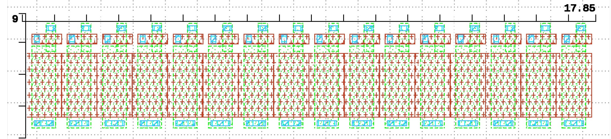

# Analog Design Flow  

[This design](./README.md) is a mixed-signal design.  
The digital design flow isn't really applicable.  
  
It is rather counterproductive to do a top down design.  
The proof is in the analog layout pudding, 
and accurate extraction and modeling of the key analog elements.  

## In progress  

* Lay out switched cascode transistor  
    * pmos transistor with  
        * gate contact  
        * drain contact  
        * source connected to current source transistor by pdiffusion abutment  
    * arrangeable in an array by abutment  
        * the width of the cascode transistor, plus the gate contact and poly spacing, 
          determine the width of a unit current source  
    * define as [DRC clean parametrizable cell](https://github.com/tatzelbrumm/klayoutAPI/blob/master/switched_pmos_cascode.py)  
        * cascode length  
        * cascode width  
* Extend cascode transistor to switched cascoded current source  
    * for good matching and low 1/f noise, long and narrow  
    * arrangeable in an array by abutment  
    * shared poly for common bias voltage  

### [Proof-of-concept unit cell](https://github.com/tatzelbrumm/PUDDING/blob/tatzelbranch/gds/swcascsrc_playground.gds)  

width: 1.1&mu;m, height 3.9&mu;m  

#### Layout
    

* [DRC and LvS clean row of 16 unit current sources](https://github.com/jobueh/PUDDING/blob/tatzelbranch/gds/swsources16.gds)  
* [Test schematic with 2 unit sources as reference current mirror, 16 output sources](https://github.com/jobueh/PUDDING/blob/tatzelbranch/xschem/test_pcascsrc16_DC.sch)  

* **Design cascode bias generator**  
    * **Create test schematics to characterize gm/Id and gm/go of transistors**  
    * **Create test schematics to characterize go of cascoded current sources as function of voltage**  
* Extend cascode transistor to switched cascoded current source  
    * define as DRC clean parametrizable cell  
        * current source length  
        * current source width  
        * cascode length  
        * cascode width  
* Extract [post-layout netlist for LvS](https://github.com/jobueh/PUDDING/blob/tatzelbranch/gds/PCASCSRC16_extracted.cir)  
  to compare against [xschem schematic](https://github.com/jobueh/PUDDING/blob/tatzelbranch/xschem/simulation/pcascsrc16.spice)  

## To do  

* Extract post-layout netlist with parasitics  
* Use suitable device models  
    * that can handle millikelvin temperatures  
    * Make the models available in the open environment  
    * If the models don't exist, write them  

* Find out how to generate analog/mixed signal pad frames  
    * Preferably without involving the librelane overhead  
        * Look at Krzysztof Herman's repositories and examples  
    * Suitable for stand-alone submission of designs 
        * in the last free IHP BiCMOS run  
        * in the last free IHP CMOS engineering run  
        * Find valid reasons to submit designs on later IHP characterization runs  

* Design input current sinks for unit current generation  
    * External input pad  
    * on-chip current reference (if sufficient time and support)  

## References  

[IHP Open PDK](https://github.com/IHP-GmbH/IHP-Open-PDK/)  
[IHP Open PDK docs](https://github.com/IHP-GmbH/IHP-Open-PDK-docs/)  
